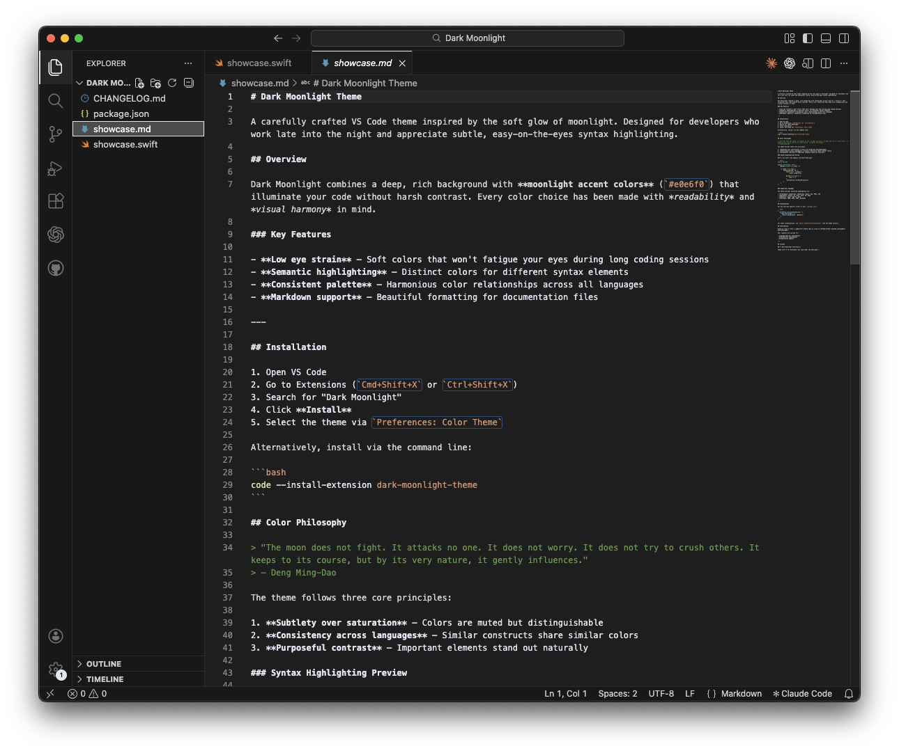
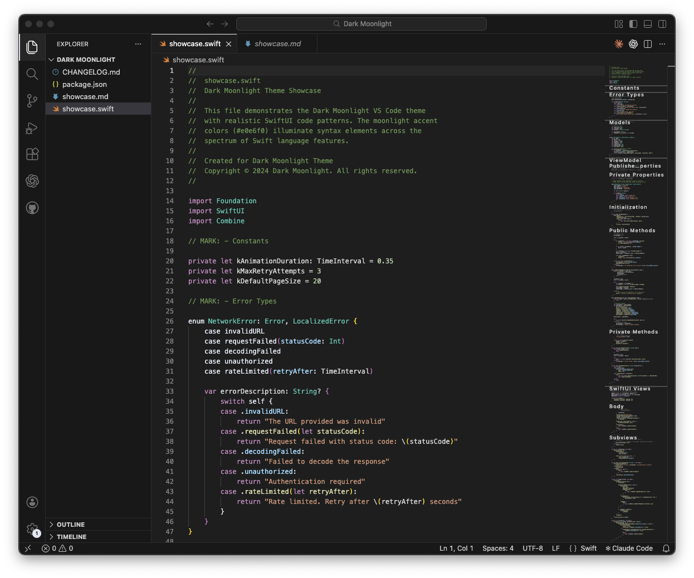
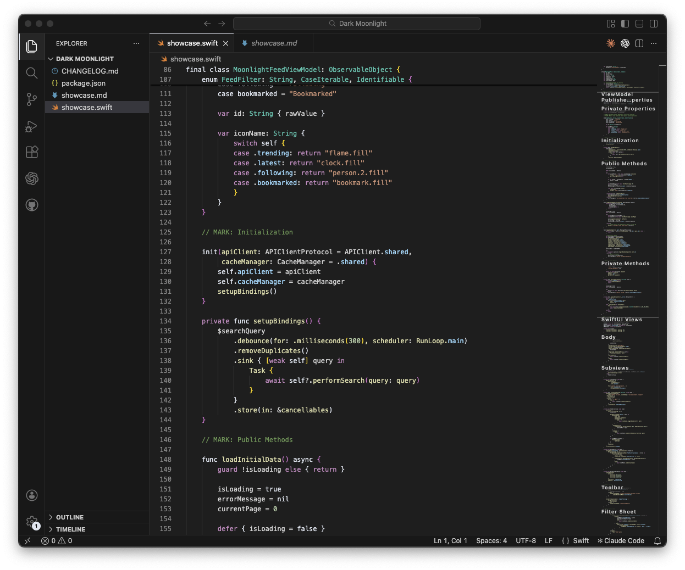

# Dark Moonlight

A dark VS Code theme based on Dark Modern, with all blue accent colors replaced by soft moonlight gray-white (`#e0e6f0`). Features beautiful markdown support and SwiftUI-optimized syntax highlighting.

## Features

- **Dark Modern foundation** - Built on VS Code's Dark Modern theme (`#1e1e1e` background)
- **Moonlight accents** - All blue colors (`#007acc`, `#0078d4`, `#569cd6`, etc.) replaced with `#e0e6f0`
- **Subtle and calm** - Reduced visual noise with neutral accent colors
- **Complete coverage** - UI elements, syntax highlighting, terminal colors, and semantic tokens

## Screenshots

### Markdown Documentation
*Beautiful formatting with the Deng Ming-Dao philosophical quote*

### Swift Error Handling
*Enums and switch statements with clear syntax highlighting*

### Swift ViewModel
*Async functions, initialization, and Combine patterns*

## Installation

### From VS Code Marketplace

1. Open VS Code
2. Go to Extensions (`Cmd+Shift+X` / `Ctrl+Shift+X`)
3. Search for "Dark Moonlight"
4. Click Install
5. Select the theme: `Cmd+K Cmd+T` → "Dark Moonlight"

### Manual Installation

1. Download or clone this repository
2. Copy the folder to your VS Code extensions directory:
   - **macOS**: `~/.vscode/extensions/`
   - **Windows**: `%USERPROFILE%\.vscode\extensions\`
   - **Linux**: `~/.vscode/extensions/`
3. Restart VS Code
4. Select the theme: `Cmd+K Cmd+T` → "Dark Moonlight"

### From VSIX File

1. Download the `.vsix` file from [Releases](../../releases)
2. In VS Code, open Command Palette (`Cmd+Shift+P`)
3. Run "Extensions: Install from VSIX..."
4. Select the downloaded file

## Color Palette

| Element | Color |
|---------|-------|
| Background | `#1e1e1e` |
| Sidebar/Panel | `#181818` |
| Foreground | `#cccccc` |
| Accent (moonlight) | `#e0e6f0` |
| Strings | `#ce9178` |
| Functions | `#dcdcaa` |
| Keywords | `#c586c0` |
| Types | `#4ec9b0` |
| Comments | `#6a9955` |
| Numbers | `#b5cea8` |

## Contributing

Contributions are welcome! Please feel free to submit a Pull Request.

## License

[MIT](LICENSE)

## Acknowledgments

- Based on VS Code's Dark Modern theme
- Inspired by moonlit nights and minimal aesthetics
